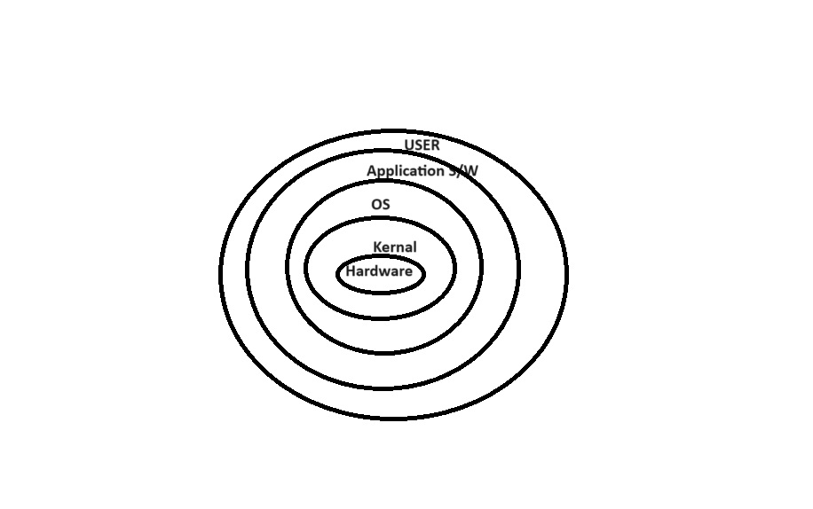
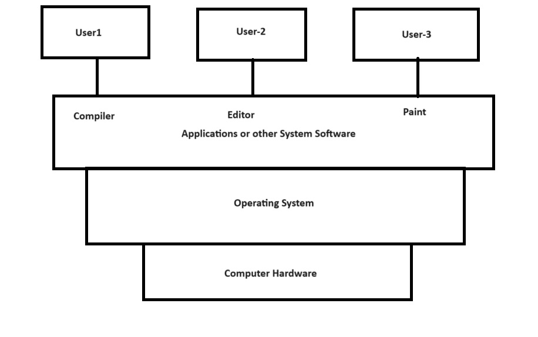
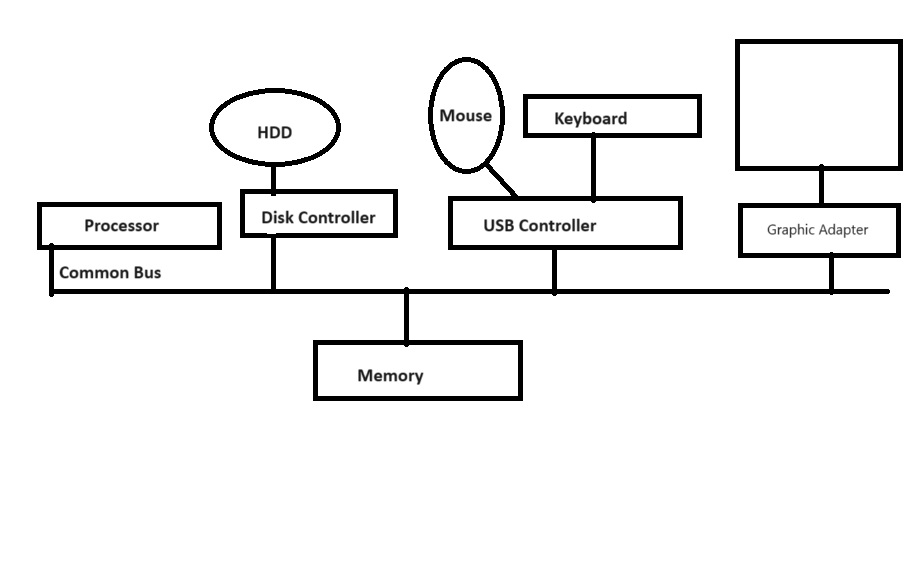
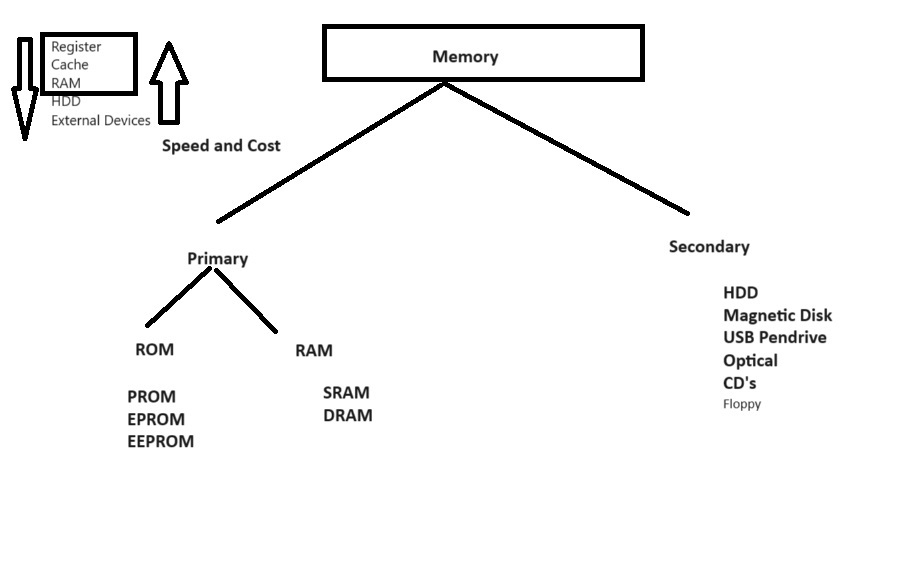
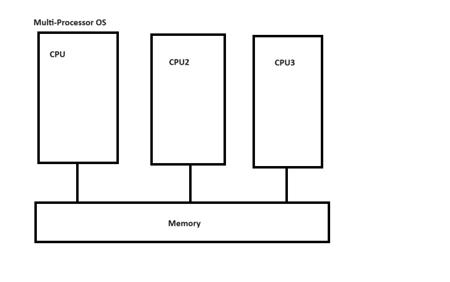
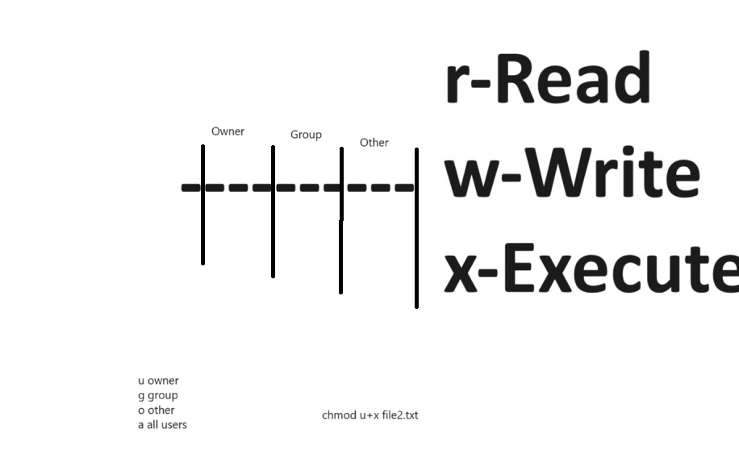

### OS Notes Day-1 Date: 27-08-2024
#### Session-1: Introduction to Operating System
- What is OS?
    - Hardware Manager: It manage all the hardware resources or components of computer.
    - Process Manager: It supervise all the task/process/job which is being executed by processor.
- How is it different from other application software?
    - OS is installed over hard-drive.
    - Applications are also installed over hard-drive but under the layer of OS.
    - OS runs over computer system, and Applications runs over OS.
- Why is it hardware dependent?

- Different components of OS

- Basic computer organization required for OS.

- Examples of well-known OS
    1. Mobile OS: Android, iOS, Windows
    2. Embedded System OS:
    3. Real Time OS: HRT, SRT
    4. Desktop OS: Personal Computer
    5. Server machine OS etc.
- How are these different from each other and why?
- Functions of OS
    - Process Management (Process Scheduling Algo)
    - Memory Management 
    - Device Management (HDD, Printer, Monitor, Spealer, WebCam)
    - Disk Management (Disk Scheduling Algos)
    - Network Management (Network Card / Controller)
    - File Management
    - Security Management (Firewall, Anti Virus, Anti Spyware)
- User and Kernel space and mode; 
- Interrupts and system calls
- Memory Hierarchy in Computer System
    1. Primary Memory: RAM, ROM (PROM, EPROM, EEPROM): BIOS/Firmware/UEFI
    2. Secondary Memory:HDD, SSD, Magnetic Tape, Pendrive, External HDD, CDs, Flopy

- Types of Operating System
- Batch Operating System
- Multi-Programming OS
- Multiprocessor OS

- Distributed OS
- Desktop OS
- Server OS
#### Session-2: Introduction to Linux
- It is an Open Source operating system. It is available free to use and user can modify it according their need.
- The founder or linux is Linun Torvards. It available since 1991.
- An Open Source Community is woking behind the updation and upgradation of the linux code.
- Feature
    1. No Cost / Low Cost
    2. Multi-Tasking
    3. Security
    4. Multi-User
    5. Stable and Scalable
    6. Networking
    7. CLI as well as GUI
    8. Better File System
- Working with basics file system of Linux
- / is root directory
    1. /bin: User Bineries
    2. /sbin: System Bineries
    3. /etc: Configuration Files
    4. /dev: Device Files
    5. /proc: Process Information
    6. /var: Variables Files
    7. /tmp: Temporary Files
    8. /usr: User Programs
    9. /home: Parent directory of user friendly directory
    10. /boot: Boot Loader Files
    11. /opt:Apps
    12. /lib: System Libraries
- Commands associated with files/directories
    1. pwd: Present Working Directory
    2. ls: it list out all the files and directory of current working directory
    3. nano: it actually run the nano editor and open the specified file.
    4. touch: It is used to create a new file
    5. mkdir: To create a new directory.
    6. chmod: to give and revoke the file or directory permissions
    7. rm: to remove file and recursive directory
    8. rmdir: to remove a prticuler directory
    9. cd: to change directory
- Other basic commands.
- Ref: https://ubuntu.com/tutorials/command-line-for-beginners#1-overview
- Operators like Redirection (>), Pipe (|)
- What are file permissions and how to set them?

- Permissions (chmod, chown, etc)
- Ref: https://help.ubuntu.com/community/FilePermissions
- Access Control List
- Network Commands (telenet, ftp, ssh,sftp, finger)
- System variables like – PS1, PS2 etc. How to set them?
- Shell Programming
- What is shell; What are different shells in Linux?
- Shell variables; Wildcard symbols
- Shell meta characters; Command line arguments; Read, Echo
#### Session-3: Shell Programming
- Decision loops (if else, test, nested if else, case controls, while…until, for)
- Regular expressions; Arithmetic expressions
- More examples in Shell Programming