### OS Notes Day-2 Date: 28-08-2024
#### Session-3: Introduction to Linux continue...
- It is an Open Source operating system. It is available free to use and user can modify it according their need.
- The founder or linux is Linun Torvards. It available since 1991.
- An Open Source Community is woking behind the updation and upgradation of the linux code.
- Feature
    1. No Cost / Low Cost
    2. Multi-Tasking
    3. Security
    4. Multi-User
    5. Stable and Scalable
    6. Networking
    7. CLI as well as GUI
    8. Better File System
- Working with basics file system of Linux
- / is root directory
    1. /bin: User Bineries
    2. /sbin: System Bineries
    3. /etc: Configuration Files
    4. /dev: Device Files
    5. /proc: Process Information
    6. /var: Variables Files
    7. /tmp: Temporary Files
    8. /usr: User Programs
    9. /home: Parent directory of user friendly directory
    10. /boot: Boot Loader Files
    11. /opt:Apps
    12. /lib: System Libraries
- Commands associated with files/directories
    1. pwd: Present Working Directory
    2. ls: it list out all the files and directory of current working directory
    3. nano: it actually run the nano editor and open the specified file.
    4. touch: It is used to create a new file
    5. mkdir: To create a new directory.
    6. chmod: to give and revoke the file or directory permissions
    7. rm: to remove file and recursive directory
    8. rmdir: to remove a prticuler directory
    9. cd: to change directory
- Ref: https://ubuntu.com/tutorials/command-line-for-beginners#1-overview
- What are file permissions and how to set them?
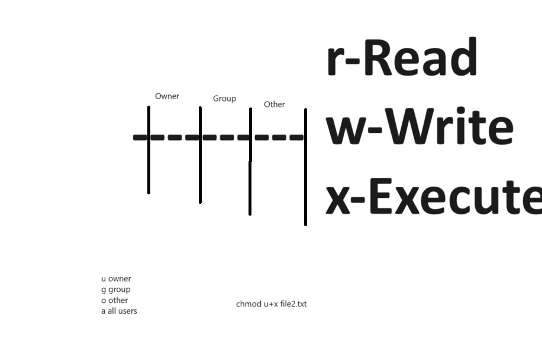
- Permissions (chmod, chown, etc)
- Ref: https://help.ubuntu.com/community/FilePermissions
- chown: to change owner of the file 
- su: to switch the user from current to any specified user
- cat: to display content of the file on console
- head: to display top n lines of the file on console. By default it will print first 10 lines
- tail: to display bottom n lines of the file on console. By default it will print last 10 lines
- adduser: to add new user into the system
- sudo: to give some specific privilages to the user's other than root. 
- Operators like Redirection (>)
- Other basics command
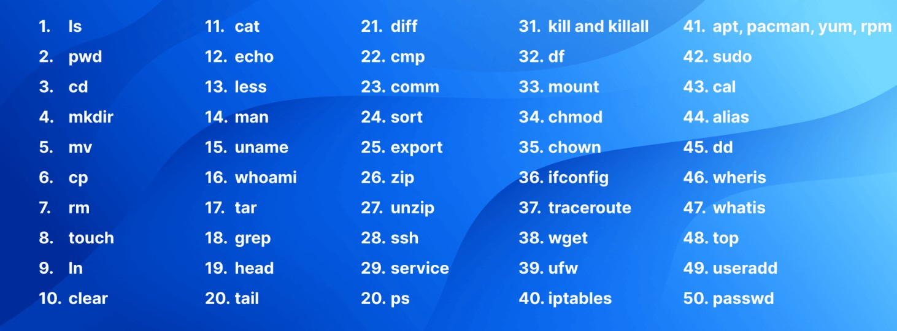
#### Process Management
- User Mode and Kernal Mode (System calls)
- System Calls types
    1. File releated calls: Read(), Write(), Delete(), Open(), Close(), Create()
    2. Process related calls: New(), Fork(), Exit(), Wait(), Running(), etc.
    3. Device related calls: Read(), ioctl etc.
    4. Information related: getpid, gettime, sysdata, etc.
    5. Communucation related: wait(), signal(), status, etc.
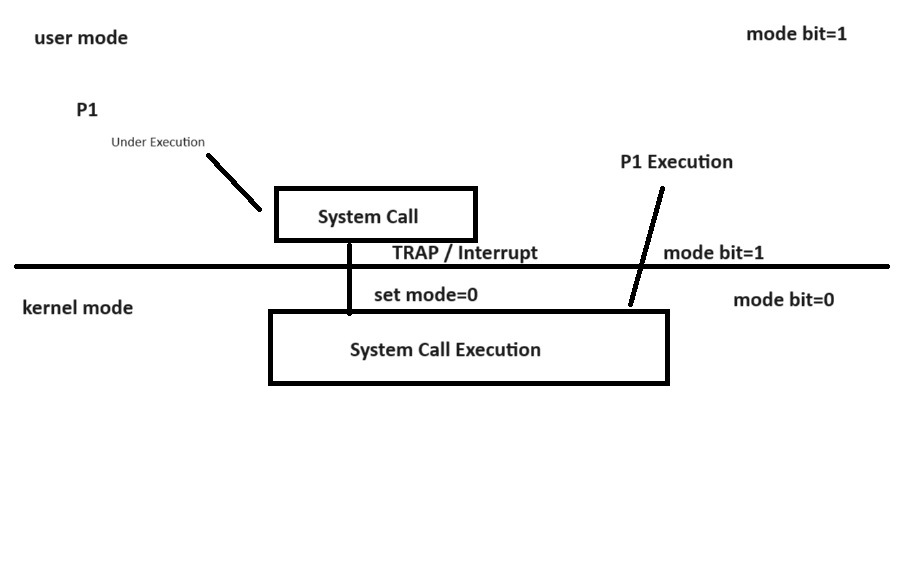
- Process: It is information or code or data which help the processor to execute or complete the user task.
    1. Code Segment: It consist of compiled code or instructions to be executed
    2. Data Segment: It consist of data required for the execution.
    3. Information Segment: It have metadata about the system variables or system which help in the process execution.
    4. Memory Segment: Heap and Stack
- Process Life Cycle
    1. New State
    2. Ready State (Ready Queue)
    3. Running State- Processor is executing the process
    4. Terminated State
    5. Wait State
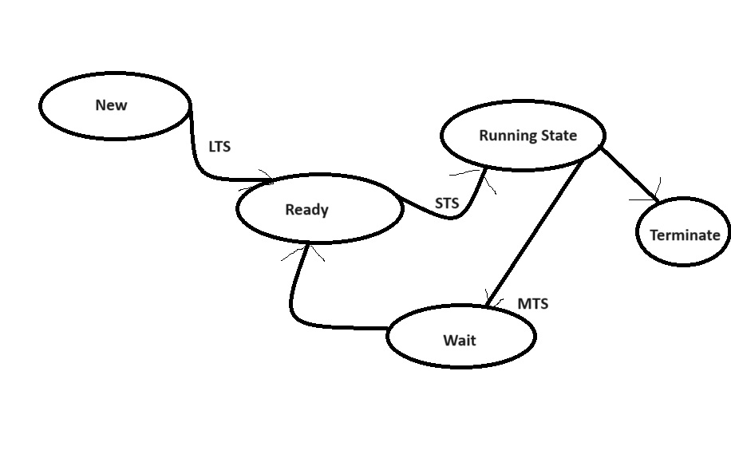
- Process Schedulers
    1. Long Term Schedulers (LTS)
    2. Short Term Schedulers
    3. Medium Term Schedulers
- Process Control Block (PCB) (Kindly read all attributes of PCB)
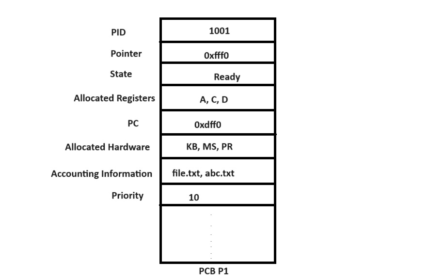
- Scheduling Algorithms
    1. Pre-Emptive Scheduling
    2. Non Pre-Emptive Scheduling
        1. FCFS (First Cum First Serve)
            - Waiting Time of Process= CPU Allocation-Arrival Time
            - Avg Waiting Time = Sum WT of All process / no. of processes
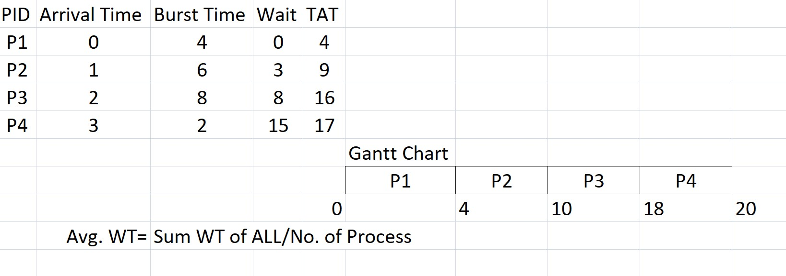
        2. SJF (Shortest Job First)
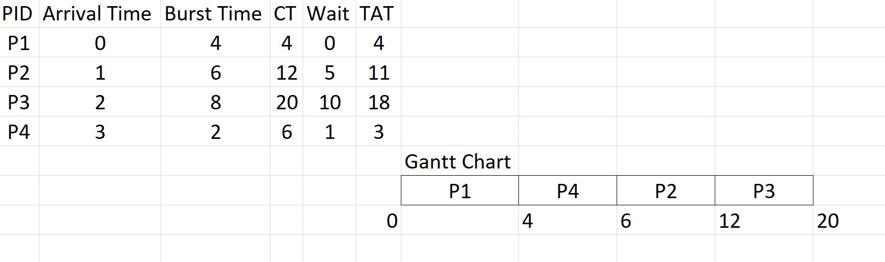
        3. Round-Robin
            - In round robin algo a fixed slice of time is given to each an every process. That slice of time is know as quantum.
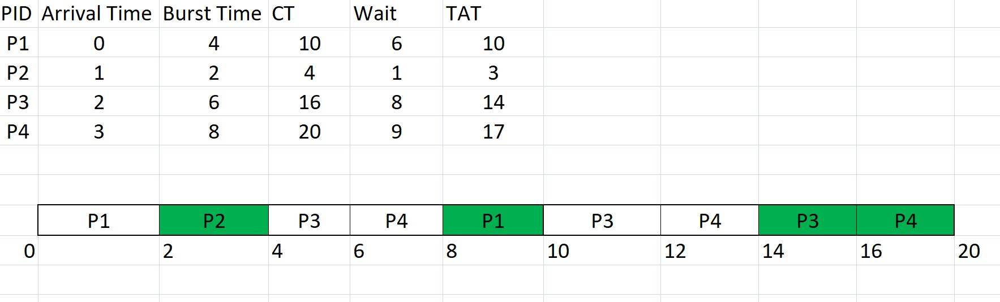
- RR with AT 0
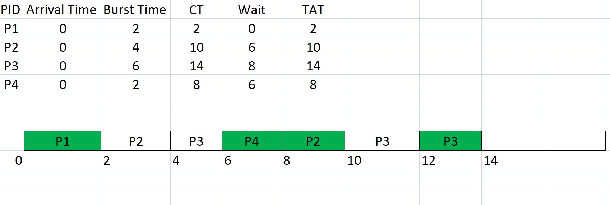
        4. Priority
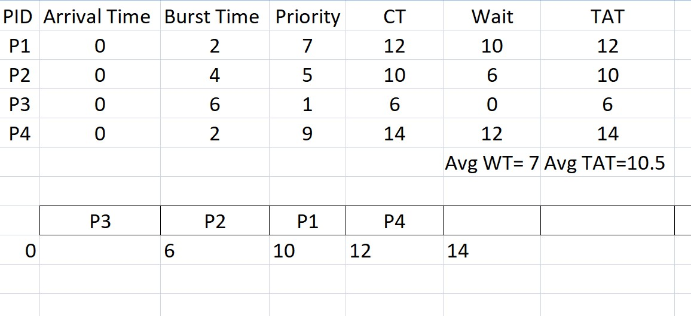
- PR with some AT
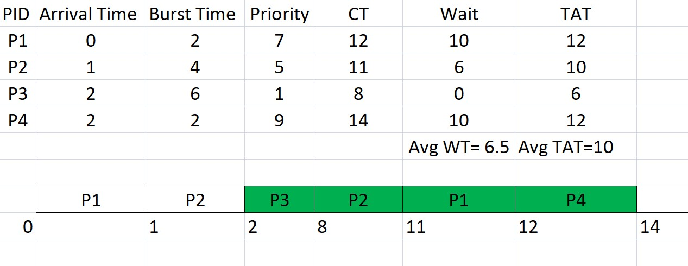
#### Memory Management (RAM)
- The memory of computer systems can be divided into block of fized size or variable size.
- This process is known as Fixed Size Partioning and Varibale Size Partioning respectively.
- Fixed Size Partioning: Here the memory is divied into fixed size blocks where all the blocks are of size like either 2 Bytes, 4 Bytes , etc.
    - The Process which will get the memroy may be small or equal to the partitioning block size.
    - As the process size may be smaller than block, it give rise to Internal Fragmentation
- Variable Size Partioning: Here the memory is divided into variable size blocks in which blocks may have size 2 Bytes, 3 Bytes or any size.
    - In varibale size partioning during contigous memory allocation some time total memory available can not given to the new process which leads to External Fragmentation.
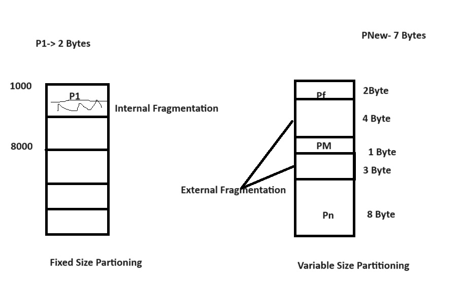
- Compaction
#### Linux Commands to be discussed
- Pipe (|)
- Access Control List
- Network Commands (telenet, ftp, ssh,sftp, finger)
- System variables like – PS1, PS2 etc. How to set them?
#### Shell Programming (to be discussed)
- What is shell?
- What are different shells in Linux?
- Shell variables
- Wildcard symbols
- Shell meta characters
- Command line arguments
- Read
- Echo
- Decision loops (if else, test, nested if else, case controls, while…until, for)
- Regular expressions; Arithmetic expressions
- More examples in Shell Programming