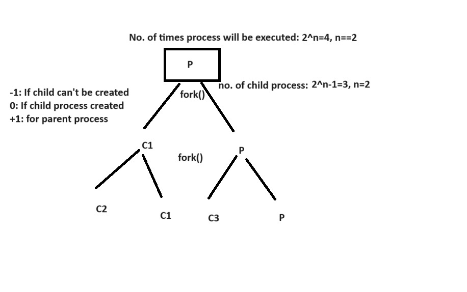
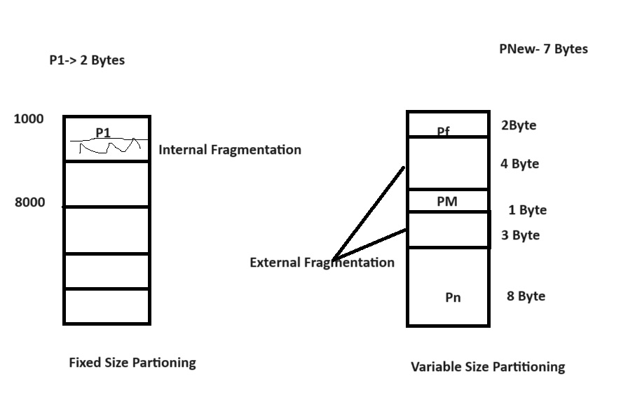
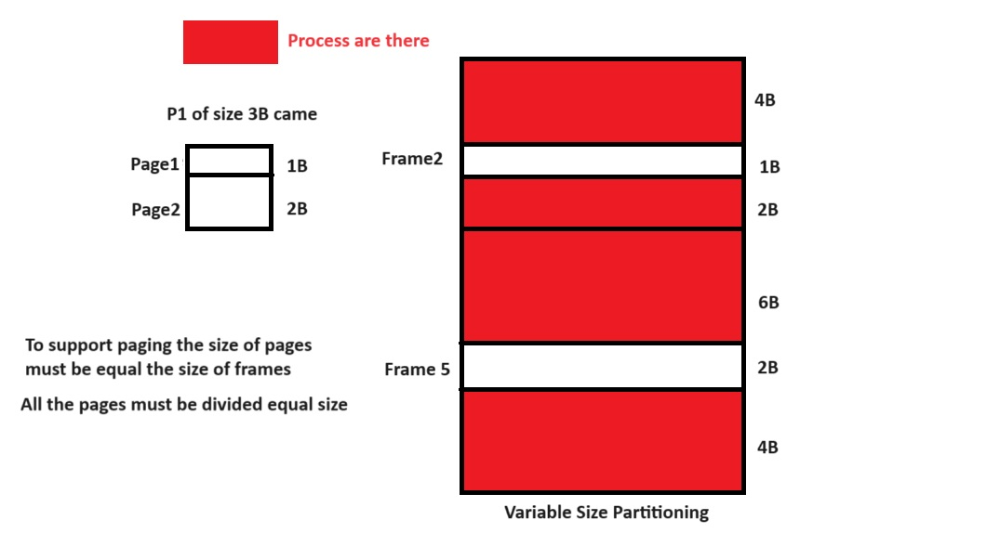
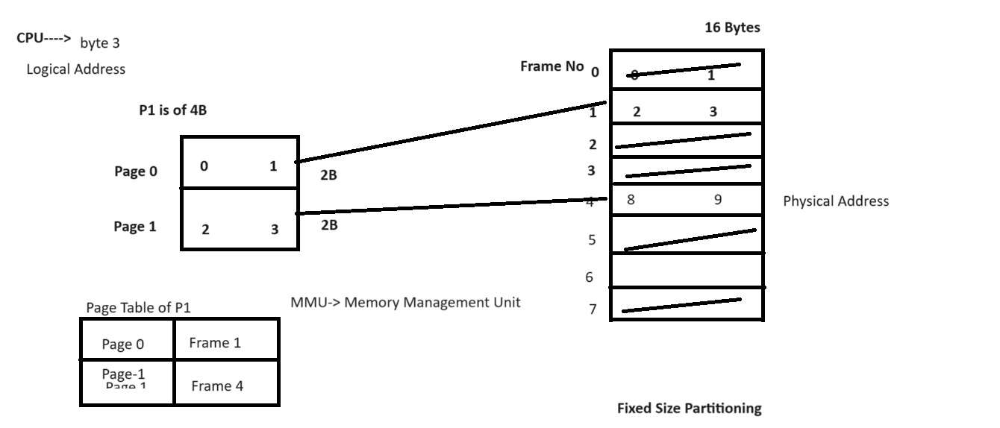
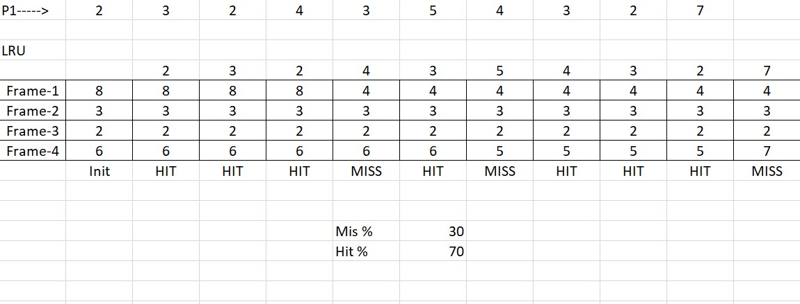
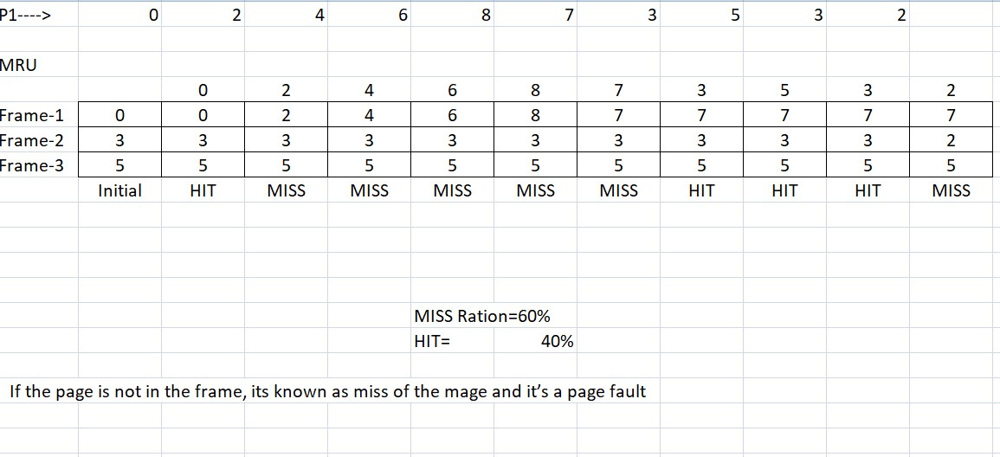

### OS Notes Day-3 Date: 29-08-2024
#### Process Scheduling Revision
- Please read->Convey Effect, Starvation, RR Disadvantages, Arrival Time, Response Time, Completion Time, Waiting Time, Turn Around Time, etc.
- Process creation using fork
    - fork(): It is method / system call which is used to create child process of the current process being executed.
    - What a child process does: It does exactly the same for which you have design the parent process. 
- waitpid and exec system calls (fork-exec-wait)

- Examples on process creation
```C
#include<stdio.h>
int main()
{
fork();
fork();
printf("Hello All\n");
return 0;
}
```
- Parent and child processes
- Orphan and zombie processes
#### Memory Management (RAM)
- The memory of computer systems can be divided into block of fized size or variable size.
- This process is known as Fixed Size Partioning and Varibale Size Partioning respectively.
- Fixed Size Partioning: Here the memory is divied into fixed size blocks where all the blocks are of size like either 2 Bytes, 4 Bytes , etc.
    - The Process which will get the memroy may be small or equal to the partitioning block size.
    - As the process size may be smaller than block, it give rise to Internal Fragmentation
- Variable Size Partioning: Here the memory is divided into variable size blocks in which blocks may have size 2 Bytes, 3 Bytes or any size.
    - In varibale size partioning during contigous memory allocation some time total memory available can not given to the new process which leads to External Fragmentation.

- Compaction: Process of moving empty space of memory to one side of the memory to get large block of the free memory.
##### Paging – What is paging;
- Paging
    - Dividing the process into fixed sizes pages is know as paging.
    - Why Paging: Instead of loading the whole process which can't be loaded into main memory OS loads few pages of the process into main memory accoring to frames available and other pages loaded from storage device on demand of CPU.

- Paging table: It is a special table maintained by MMU (Memory Management Unit) to map the logical address of the demanded page with the physical address of the page in main memory where actualy the page is placed.

- Demand paging
    - If the page is loaded in memory frame as per the demand of CPU i.e. known as demand paging.
- Page faults
- Page replacement algorithms
    1. LRU

    2. MRU

    3. OPR
- Hardware required for paging
- Translation look aside buffer
- What is virtual memory
- Concept of dirty bit
- Shared pages and reentrant code
- Throttling
##### Segmentation – What is segmentation?
- Hardware requirement for segmentation?
- Segmentation table and its interpretation
#### Linux Commands to be discussed
- Pipe (|)
- Access Control List
- Network Commands (telenet, ftp, ssh,sftp, finger)
- System variables like – PS1, PS2 etc. How to set them?
#### Shell Programming (to be discussed)
- What is shell?
- What are different shells in Linux?
- Shell variables
- Wildcard symbols
- Shell meta characters
- Command line arguments
- Read
- Echo
- Decision loops (if else, test, nested if else, case controls, while…until, for)
- Regular expressions; Arithmetic expressions
- More examples in Shell Programming