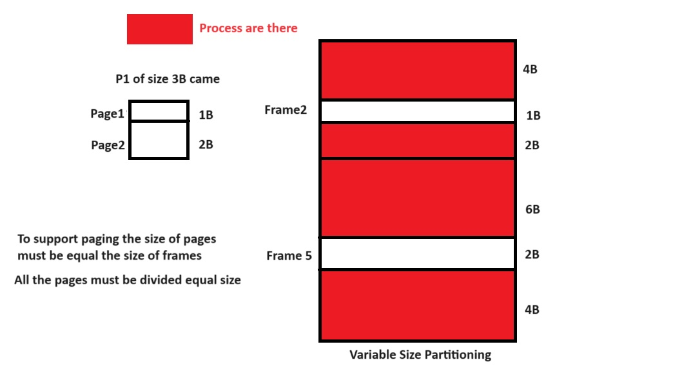
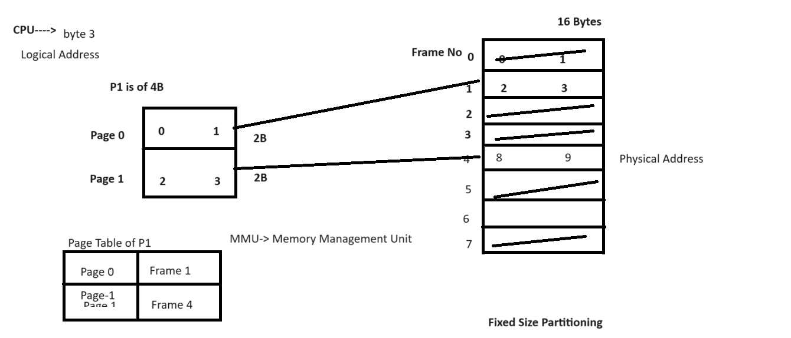
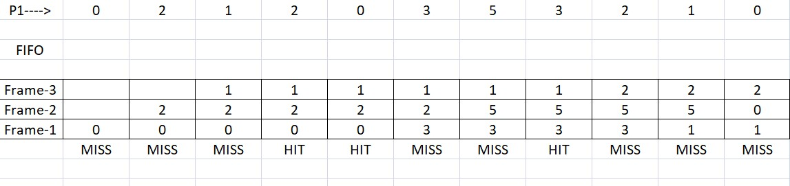
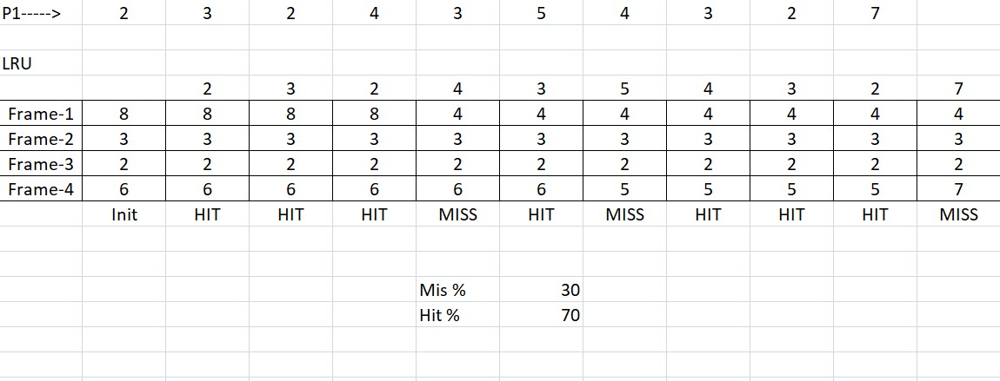
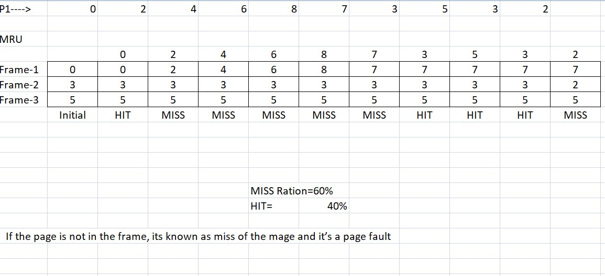
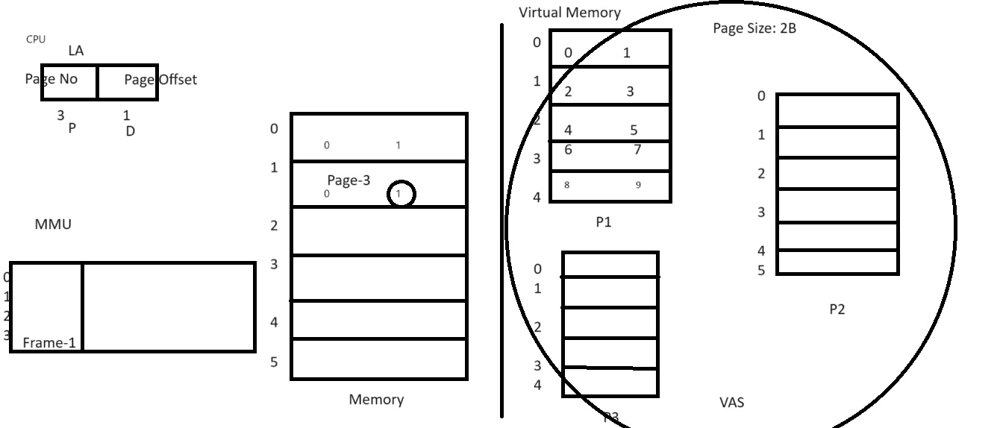
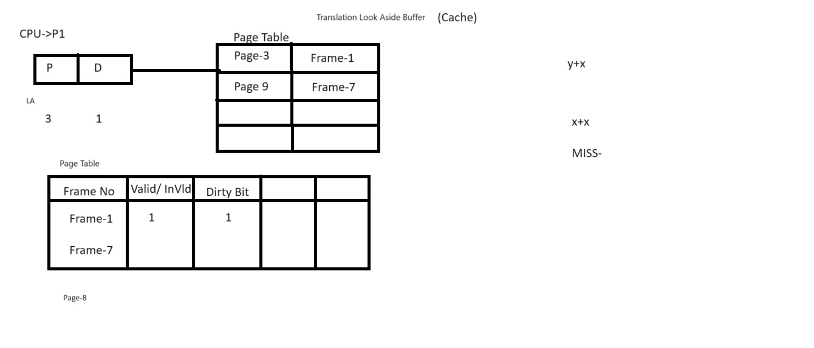
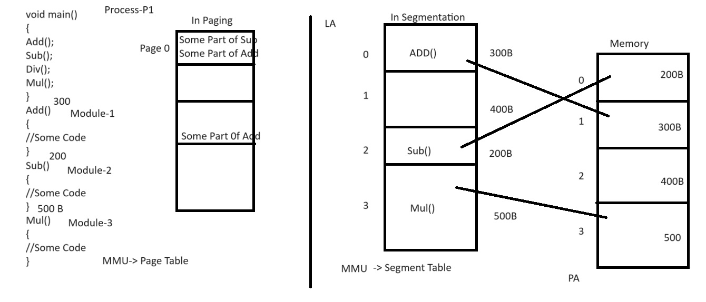

### OS Notes Day-4 Date: 30-08-2024
##### Paging – What is paging?
- Paging
    - Dividing the process into fixed sizes pages is know as paging.
    - Why Paging: Instead of loading the whole process which can't be loaded into main memory OS loads few pages of the process into main memory accoring to frames available and other pages loaded from storage device on demand of CPU.

- Paging table: It is a special table maintained by MMU (Memory Management Unit) to map the logical address of the demanded page with the physical address of the page in main memory where actualy the page is placed.

- Demand paging
    - If the page is loaded in memory frame as per the demand of CPU i.e. known as demand paging.
- Page faults: If CPU demands a page and its not there in main memory. That time an interrupt generated to load the page from virtual memory / hard-drive.
- Page replacement algorithms
    1. FIFO (First in First Out)

    - Belady's Anomly: It state that if we increase the number of frames, the HIT Ratio decreased. 
    2. LRU

    3. MRU

- Hardware required for paging (Virtual + Cache)
- What is virtual memory
    - Its a memory space in hard-drive, which work like physical memory to entertain large processes whose size is bigger than the RAM. It is an illusion memory.
    - In Virtual Memory process is divided into fixed sized partions know as pages.
    - OS loads the process's pages from virtual memory to physical memory on demand of CPU i.e. known as Demand Paging.
    - While working with virtual memory pages are saved as per their logical address.
    - While loading the pages from virtual memory to physical memory the pages get physical address.
    - If a page loaded from virtual memory to physical memory i.e. know as swap-in process.
    - If the page is shifted from physical memory to logical memory by the replacement process i.e. know swap out.

- Translation look aside buffer
    - It is a page table represented in cache memory to fasten the process of finding physical address for a given logical address.
    - In paging we load only few pages in main memory of a particuler process. Entries of that pages is made in MMU Page Table which is actually present at physical memory. To find a frame MMU first look into page table and then according page table entry it accress the given frame no. This process is actually access the RAM twice. So to reduce this access OS use Translation Look Aside Buffer in cache memory.

- Concept of dirty bit
    - It is a bit in page table which describe either the page content is updated during the execution or not. If for a specific frame the content is updated then its dirty is set to 1, other wise its always 0.
##### Segmentation – What is segmentation?
- It is the method of dividing a process into variable size partitions known as Segments on the basis of module / Functions of the process to be executed.

#### Reading Assigment
- Shared pages and reentrant code
- Throttling
#### Shell Programming
- What is shell?
    - Shell is interface b/w user and kernal.
    - It take input from user and pass it on to the kernal.
    - An user can interact with kernal by using shell commands or shell script / program.
- What are different shells in Linux?
    - /bin/sh
    - /bin/bash
    - /usr/bin/bash
    - /bin/rbash
    - /usr/bin/rbash
    - /usr/bin/sh
    - /bin/dash
    - /usr/bin/dash
    - /usr/bin/tmux
    - /usr/bin/screen
- Shell variables
    - Shell varibale can be defined using any name without the type of the variable
- Example:
```sh
X=100;          //X will store value 100
Y="Malkeet"     //Y will store the value "Malkeet"
echo $X         //To access the variable you should use $ sign before the variable name
```
- Read: Its is used to read input from keyboard
- Echo: It used to print output something in screen.
- Decision loops in shell scripting / programming 
    - if else
-Syntax:
```sh
if [ condition ]
then
    statement
else
    statement
fi (end of if)
```
- Example:
```sh
echo "Enter Num1"
read Num1
if [ $Num1 -eq 5 ]
then
        echo "Number is equal to 5"
else
        echo "Number is not equal to 5"
fi
```
    - nested if- else
- syntax:
```sh
if [ condition ]  //Outer-if
then
if [ condition ]   //Inner-if in if part
then
    statement
else //else part of inner-if
    statement
fi (end of inner if)
else //else of outer if
if [ condition ]
then
    statement
else //else of inner if 
fi (end of inner if)
fi (end of outer if)
```
- Example: Nested if-else
```C
echo Enter Num1
read Num1
echo Enter Num2
read Num2
echo Enter Num3
read Num3
if [ $Num1 -gt $Num2 ]
then
if [ $Num1 -gt $Num3 ]
then
        echo Num1 is greatest
else
        echo Num3 is greatest
fi
else
        if [ $Num2 -gt $Num3 ]
then
        echo Num2 is greatest
else
        echo Num3 is greatest
fi
fi
```
#### To be discussed tomorrow (31-08-2024)
- loops in shell programming
- Wildcard symbols
- Shell meta characters
- Command line arguments
- Regular expressions; Arithmetic expressions
- More examples in Shell Programming
- Pipe (|)
- Access Control List
- Network Commands (telenet, ftp, ssh,sftp, finger)
- System variables like – PS1, PS2 etc. How to set them?
#### OS Concepts
- OPR in paging
- Hardware requirement for segmentation
- Segmentation table and its interpretation
- Paging vs Segmentation
- Deadlock
    - Necessary conditions of deadlock
    - Deadlock prevention and avoidance
    - Semaphore
    - Mutex
    - Producer consumer problem
    - Dead-lock vs Starvation