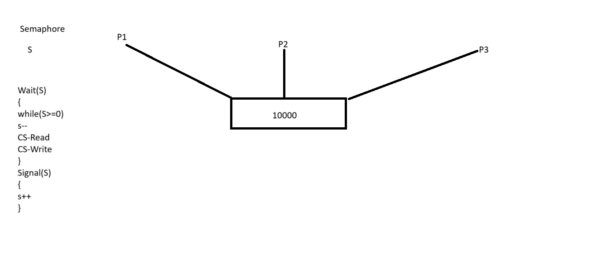

### OS Notes Day-5 Date: 31-08-2024
#### Shell Programming
- What is shell?
    - Shell is interface b/w user and kernal.
    - It take input from user and pass it on to the kernal.
    - An user can interact with kernal by using shell commands or shell script / program.
- What are different shells in Linux?
    - /bin/sh
    - /bin/bash
    - /usr/bin/bash
    - /bin/rbash
    - /usr/bin/rbash
    - /usr/bin/sh
    - /bin/dash
    - /usr/bin/dash
    - /usr/bin/tmux
    - /usr/bin/screen
- Shell variables
    - Shell varibale can be defined using any name without the type of the variable
- Example:
```sh
X=100;          //X will store value 100
Y="Malkeet"     //Y will store the value "Malkeet"
echo $X         //To access the variable you should use $ sign before the variable name
```
- Read: Its is used to read input from keyboard
- Echo: It used to print output something in screen.
- Decision loops in shell scripting / programming 
    - if else
-Syntax:
```sh
if [ condition ]
then
    statement
else
    statement
fi (end of if)
```
- Example:
```sh
echo "Enter Num1"
read Num1
if [ $Num1 -eq 5 ]
then
        echo "Number is equal to 5"
else
        echo "Number is not equal to 5"
fi
```
    - nested if- else
- syntax:
```sh
if [ condition ]  //Outer-if
then
    if [ condition ]   //Inner-if in if part
    then
        statement
    else //else part of inner-if
        statement
    fi (end of inner if)
else //else of outer if
    if [ condition ]
    then
        statement
    else //else of inner if 
    fi (end of inner if)
fi (end of outer if)
```
- Example: Nested if-else
```C
echo Enter Num1
read Num1
echo Enter Num2
read Num2
echo Enter Num3
read Num3
if [ $Num1 -gt $Num2 ]
then
if [ $Num1 -gt $Num3 ]
then
        echo Num1 is greatest
else
        echo Num3 is greatest
fi
else
        if [ $Num2 -gt $Num3 ]
then
        echo Num2 is greatest
else
        echo Num3 is greatest
fi
fi
```
    - test command
- Example-1:
```sh
#!/bin/bash
x=100
y=200
if test $x -eq $y
then
echo x and y are equal
else
echo x and y are not equal
fi
```
- Please try: -eq, -gt, -le, -ge, -lt these operators with test command
- Example-2
```sh
#!/bin/bash

x=Malkeet
y=Malkeet
if test $x == $y
then
echo x and y are equal
else
echo x and y are not equal
fi
```
- Please try: >, <, ==, empty these operators with test command
- loops in shell programming
    1. for: It is used to repeat certain code upto n no. of time.
- Syntax:
```sh
a=0
for a in 1 2 3 4 5 6
do
echo $a
done
```
- Example-1
```sh
#!/bin/bash
a=0
for a in 1 2 3 4 5
do
echo $a
done
```
- Example-2
```sh
#!/bin/bash
a=0
sum=0
for a in 1 2 3 4 5
do
echo $a
sum=`expr $sum + $a`
done
echo Sum is, $sum
```
- Practice on
1. Sum of n Odd numbers
2. Sum of n even numbers
3. To find whether number is a prime or not
4. Fibbonacci series upto n  numbers
5. Factorial of number
6. Table of a number
    2. while
        - -gt, -lt, -le, -eq, -ge
- Syntax:
```sh
while [ condition ]
do
statement
increment
done
```
- Example-1
```sh
#!/bin/bash
a=0
while [ $a -lt 10 ]
do
echo $a
a=`expr $a + 1`
done
```
    3. until
- Syntax:
```sh
a=0
until [ $a -gt 10 ]
do
statement
increment expresion
done
```
- Example-1
```sh
#!/bin/bash
a=0
until [ $a -gt 10 ]
do
echo $a
a=`expr $a + 1`
done
```
- Wildcard symbols
    1. Question Mark ?
    2. Asterisk *
    3. Square Braces []
    4. Curly Braces {}
    5. Sign of Exclamation [!]
    6. Backslash \
- Ref: https://tldp.org/LDP/GNU-Linux-Tools-Summary/html/x11655.htm
- Shell meta characters
    1. Pipe (|): Piping allow us to filteartion among the result of the command. e.g. cat file2 | grep ^h
    2. Redirection (>): It allow you to use output of one command as an input of other command
    3. Asterisk (*)
    4. Tilde (~): Used for going back to the user's home directory
    5. Doller Symbol ($): It is aslo used to matching the end of the string for a line in a file.
    6. Caret (^): It is used to match the starting of the string withinggiven file
- Ref: https://opensource.com/article/22/2/metacharacters-linux
- Command line arguments
    - Special Parameters in Shell while passing command line arguments
        1. $#: No. of parameters passed
        2. $0: Script Name
        3. $i: where i can be any number, it will return that parameter
        3. $*: Give all parameters passed
```sh
#!/bin/bash
echo Number of Param, $#
echo Script Name, $0
echo Hello, $1
echo Hii, $2
echo Ok, $3
echo Bye, $*
```
- Regular expressions
    - | grep ^S: Tt will filter the pipeline and get the words which are starting with S
    - | grep ^n.*f$: It will filter the pipeline and get the lines which are starting with n and ending f
    - ls f*: It will return all the file starting with f
- Arithmetic expressions
    - $a + $b
    - $a - $b
    - $a / $b
    - $a * $b
```sh
#!/bin/bash
echo Enter a Number
read Num1
echo Enter a Number
read Num2
Res=`expr $Num1 \* $Num2`
echo Result, $Res
```
- Access Control List
- Network Commands
    - telenet: It is used to take the control of remote server / machine
    - ftp: File Transfer Protocol, It allow user to send or recieve file from remote server / machine
    - ssh: It is also used to take control of remote server / machine
    - sftp: Secure FTP
    - finger: 
- System variables like – PS1, PS2 etc. How to set them?
#### OS Concepts
- OPR (Optimal Page Replacement Algo)

- Hardware requirement for segmentation (Virtaul Memory + Physical Memory + Cache)
- Segmentation table and its interpretation
- Paging vs Segmentation: Self Study
- Multi-Level Paging / 2 Level Paging
- Deadlock
    - Deadlock: It is a condition where OS can't continue the execution becouse processes demanding those resource which holded by other processes. So the none of the process can continue its execution hence the deadlock occur.
    - Necessary conditions of deadlock
        1. Mutual Exclusion
        2. No Premption: If a process is holding a resource no other process can prempt it. 
        3. Hold and Wait: Processes are allow to make request for other resources while holding one.
        4. Circuler Wait: while holding and waiting for resources there should a circuler wait.

    - Deadlock Handling Techniques
        1. Deadlock Avoidance or Ignorance
        2. Deadlock Prevention
            1. No Mutual Exclusion or Pre-emptive or No Hold and Wait and No Circuler Wait
        3. Deadlock Recovery: Self Study
            1. Kill a Process
            2. Add Multiple Instance of resources
            3. Resource allocation Graph
    - Process Synchonization
        - Allowing the processes to work on or access (read / write) to a resource (memory) one by one is called process synchronization
    - Mutex

    - Semaphore

    - Producer consumer problem

    - Process synchronization is the only solution to resolve the Producer-Consumer Problem
    - Dead-lock vs Starvation
